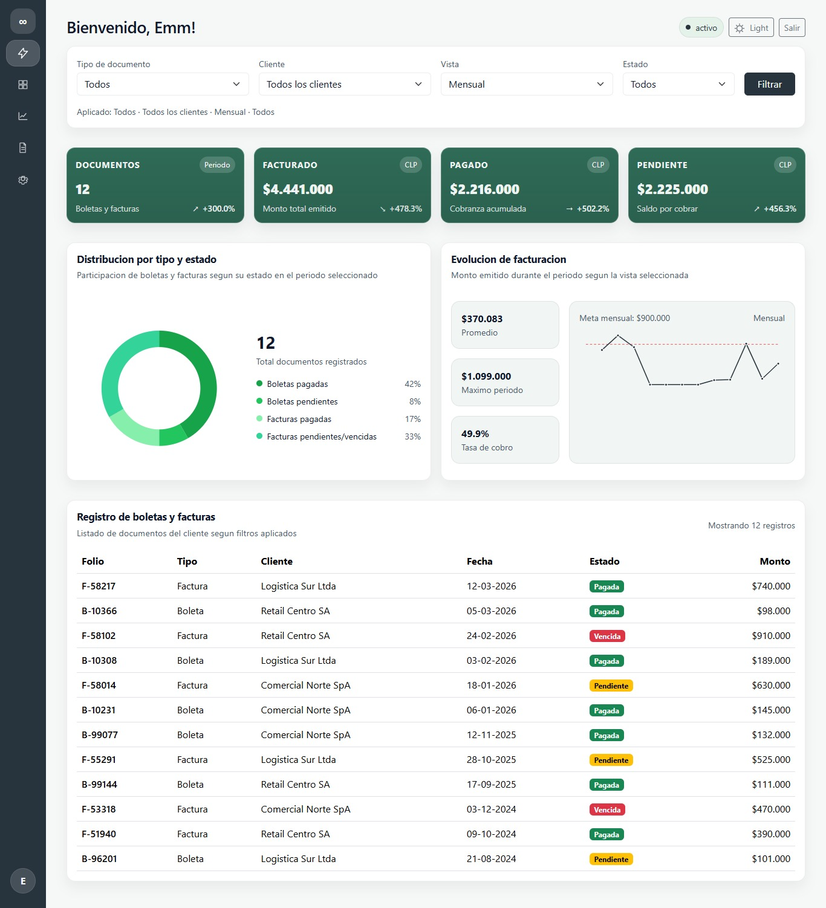
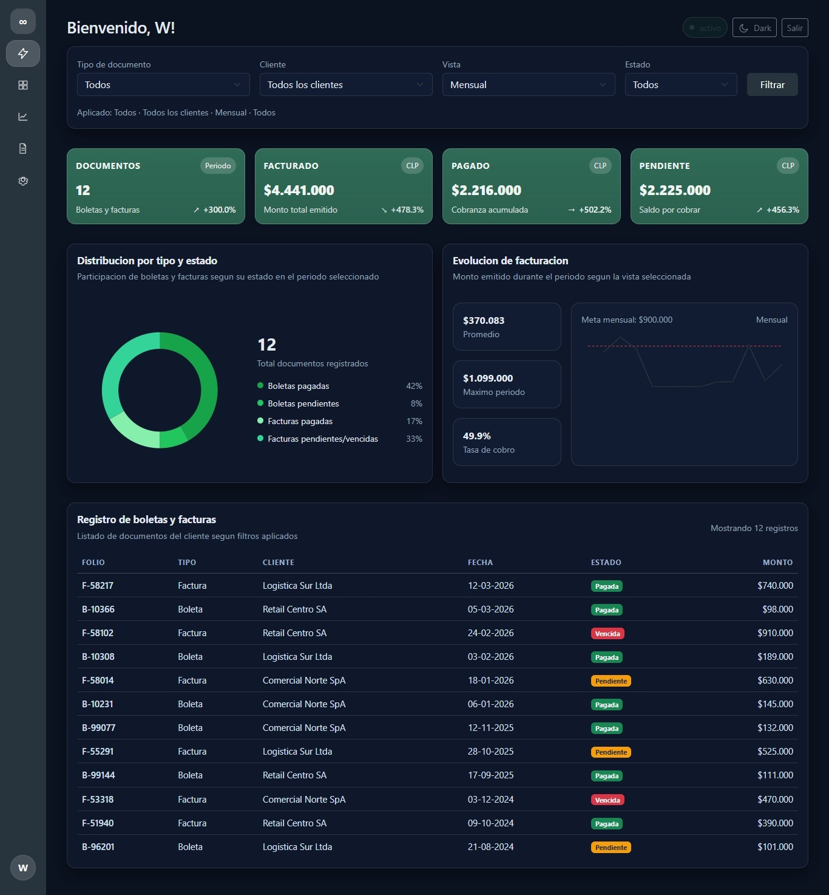
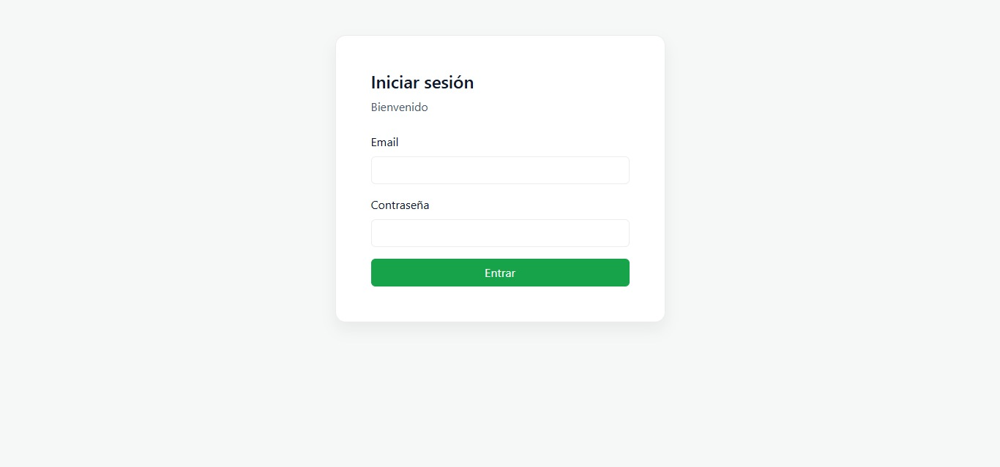

# Front end · Mockups (Login + Dashboard)

Mockups estáticos en HTML/CSS/JS para un flujo básico de autenticación y un dashboard responsive. Pensado para validar UI/UX y comportamiento visual antes de conectar APIs o integrar un framework.

## Qué incluye

- **Login** con validación mínima y persistencia de sesión en `localStorage`.
- **Dashboard** con layout responsive (sidebar + topbar), filtros y widgets de métricas.
- **Tema Light/Dark** persistente en `localStorage`.
- **Bootstrap 5.3.3 (CDN)** para base de estilos y grilla.

## Estructura

```
mockups/
  login/
    login.html
    styles.css
    script.js
  dashboard/
    dashboard.html
    styles.css
    script.js
  .vscode/
    settings.json
```

## Cómo ejecutar (recomendado)

### Opción A: VS Code + Live Server

1. Abrir la carpeta del proyecto en VS Code.
2. Ir a `mockups/login/login.html`.
3. Ejecutar **Open with Live Server**.

Nota: el proyecto trae configurado el puerto de Live Server en `5501` (ver `mockups/.vscode/settings.json`).

### Opción B: Cualquier servidor estático

Sirve la carpeta `mockups/` con tu herramienta preferida y navega a:

- `/login/login.html`

### Despliegue en Netlify

- El proyecto incluye `netlify.toml` en la raíz.
- `publish` apunta a `mockups`.
- La ruta `/` redirige automáticamente a `/login/login.html`.
- Se mantienen redirecciones de compatibilidad para:
  - `/login/index.html` -> `/login/login.html`
  - `/dashboard/index.html` -> `/dashboard/dashboard.html`

## Flujo de uso

1. Abrir el login en `mockups/login/login.html`.
2. Ingresar **cualquier email y contraseña no vacíos**.
3. Al enviar, se crea una sesión mock en `localStorage` y se redirige a `mockups/dashboard/dashboard.html`.
4. En el dashboard puedes:
   - Cambiar a **Light/Dark** (persistente).
   - Salir con **Salir** (borra sesión y vuelve al login).

## Persistencia (Local Storage)

- `ds-auth-user`: sesión del usuario (objeto JSON).
- `ds-theme`: tema (`light` | `dark`).

Para “resetear” la app, elimina esos valores desde DevTools → Application/Storage → Local Storage, o usa el botón **Salir**.

## Notas

- Esto es un **mockup**: no existe autenticación real ni conexión a backend.
- Bootstrap se carga desde CDN; sin conexión a internet los estilos base pueden no cargarse.

## Screanshoots
### dashboard


### login
#### 03/31/2026

----

